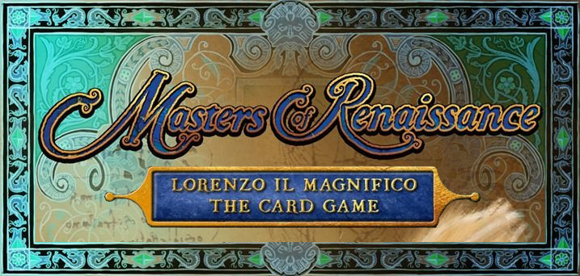

# Software Engineering Final 2020-2021
###Developed by:
- [__Martina Franzè__](https://github.com/martina-franze)
- [__Andrea Lanzi__](https://github.com/GiuseppeMarchesani)
- [__Marco Garlini__](https://github.com/Gommarlo)



This project is an implementation of Cranio Creations' board game "Masters of Renaissance".

The application uses a client-server connection to allow players to communicate with an instance of the game and play a whole match, through the use of the CLI or a GUI.
Through socket implementation, multiple clients can connect to the same server and play multiple matches concurrently.
An user can also reconnect to an ongoing match that he previously left, provided that at least one player is still connected to the game.

## Documentation
### JavaDoc
A JavaDoc is available at the following index: [Javadoc](https://github.com/GiuseppeMarchesani/ing-sw-2021-franze-garlini-marchesani/blob/main/deliverables/final/javadoc/index.html)
### UML
The following UML Diagrams were respectively developed during the planning phase of the project and after completion.

 [Planned UML](https://github.com/GiuseppeMarchesani/ing-sw-2021-franze-garlini-marchesani/blob/main/deliverables/initial_uml.png) - [Final UML](https://github.com/GiuseppeMarchesani/ing-sw-2021-franze-garlini-marchesani/blob/main/deliverables/final_uml.png)


### Add-ons
The different libraries and add-ons which were required during the development of this project are listed below:
- Maven
- JavaFX
- JUnit

##Execution

###Client
The client can be executed by typing from the terminal the following command:
```
java -jar masters-client.jar
```
The user can then choose between the CLI and the GUI by simply typing their acronym.

Due to the presence of ANSI colors, the CLI can be correctly used in UNIX environments or in Windows 10 build 16257 (or later) with the ENABLE_VIRTUAL_TERMINAL_PROCESSING flag enabled.
###Server
The server can be executed by typing from the terminal the following command which starts the server on port 4000 and on the localhost:
```
java -jar masters-client.jar
```
If the user would like to specify a different port and ip, he can do so by typing the command with the following arguments:
```
java -jar masters-client.jar <port_number> <ip_address>
```